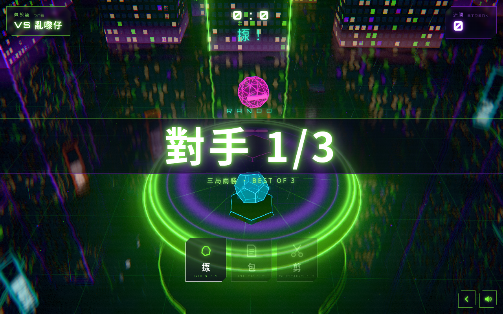

# 賽博小遊戲 CYBER MINI PACK

> 一個 App，三款街頭經典小遊戲 · three classic mini games in one app · 包剪揼 + 過三關 + 神經反射 · Three.js · 手機優先

**試玩 Play:** https://fung2222.github.io/cyber-mini-pack/ · **自動示範 Demo:** https://fung2222.github.io/cyber-mini-pack/?demo=1



## 三個模式 Modes
| 模式 | 玩法 |
|---|---|
| **包剪揼** ROCK · PAPER · SCISSORS（又寫「包剪揞」） | 三局兩勝，挑戰 3 個 AI 性格：亂嚟仔（隨機）→ 模式獵人（睇穿你嘅慣性）→ 讀心神算（預測你下一步）。連勝會記錄；輸咗可以睇廣告**保住連勝**（網頁版免費）。 |
| **過三關** TIC-TAC-TOE LADDER | 你係 ✕，喺 3D 棋盤上撳格落子。三關 AI：新手機械人 → 保安系統 → 主機核心（完美演算，**打和即過關**）。每局有 1 次免費悔棋，再悔要睇廣告（網頁版免費）。先手每局輪流。 |
| **神經反射** REACTION TEST | 光球轉綠即刻撳，一共 5 次，計平均反應時間同評級。綠燈前撳 = 偷步（該次作廢）。記錄最佳平均。 |

## 操作 Controls
| 動作 | 手機 | 鍵盤 |
|---|---|---|
| 揀模式 Select mode | 撳卡片 | 1 / 2 / 3 |
| 包剪揼出招 | 底部三粒掣 | 1 揼 · 2 包 · 3 剪 |
| 過三關落子 | 撳格仔 | 方向鍵移動 + Enter；滑鼠 hover |
| 悔棋 Undo | 悔棋掣 | Z / U / Backspace |
| 神經反射 | 撳畫面 | Space / Enter |
| 返回選單 / 暫停 / 靜音 | ‹ / — / 🔊 | Esc（結果頁）· P · M |

## 網址參數 URL flags
`?demo=1` 自動輪流示範三個模式 · `?fps=1` · `?quality=low` · `?adsim=1` · `?reset=1` · `?mute=1`

## 技術 Tech
Three.js r169 + [cyber-kit](https://github.com/fung2222/cyber-kit) v0.1.0（`vendor/cyber-kit/`），冇 build step，可離線運行。符號、棋盤、光球全部程式生成嘅原創設計；音效同音樂全部合成。

## 開發 Development
```bash
cd .. && python3 -m http.server 18940     # http://127.0.0.1:18940/cyber-mini-pack/
node cyber-mini-pack/tests/rules.test.mjs
python cyber-mini-pack/tests/smoke.py
```
文件：[docs/HANDOFF.md](docs/HANDOFF.md) · [privacy.html](privacy.html) · 屬於 [CYBER ARCADE](https://github.com/fung2222/cyber-arcade) 系列。
